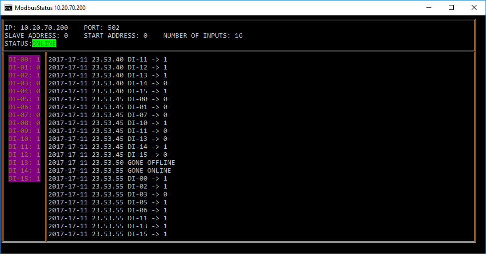

# ModbusStatus

.NET CORE 2.0 console tool for monitoring devices with Modbus protocol.



## Usage

```
dotnet ModbusStatus.dll --ip XX.XX.XX.XX
```

**Warning!** Debug build will use moq connection. Use release build to get device actual data.

### Parameters

--update-period       (Default: 500) Update period in ms

--ip                  Required.

--port                (Default: 502)

--slave-address       (Default: 0)

--start-address       (Default: 0)

--number-of-inputs    (Default: 16)

--help                Display this help screen.

--version             Display version information.
